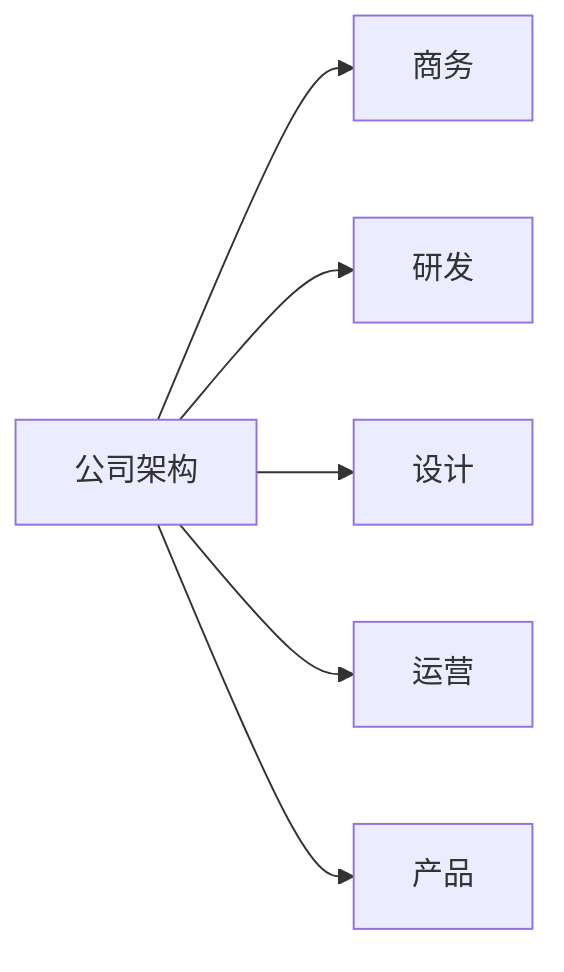

---

---
## 基本段落

> 书中自有黄金屋，书中自有颜如玉

💡 生活的意义并不是与他人争高下，而在于享受努力实现目标的过程，结果只是对自己行动的嘉奖。

## **将进酒**

李白〔唐代〕

君不见黄河之水天上来，奔流到海不复回。
君不见高堂明镜悲白发，朝如青丝暮成雪。
人生得意须尽欢，莫使金樽空对月。
天生我材必有用，千金散尽还复来。
烹羊宰牛且为乐，会须一饮三百杯。
岑夫子，丹丘生，将进酒，杯莫停。
与君歌一曲，请君为我倾耳听。
钟鼓馔玉不足贵，但愿长醉不愿醒。
古来圣贤皆寂寞，惟有饮者留其名。
陈王昔时宴平乐，斗酒十千恣欢谑。
主人何为言少钱，径须沽取对君酌。
五花马、千金裘，呼儿将出换美酒，与尔同销万古愁。

[https://tangly1024.com/](https://tangly1024.com/)

<br/>

# 特殊段落

## 1.代码


```bash
# Bash 安装zsh
$ sudo apt install zsh

# 配置ohmyzsh
$ sh -c "$(curl -fsSL <https://raw.github.com/robbyrussell/oh-my-zsh/master/tools/install.sh>)"

# 配置ohmyzsh插件
# zsh-autosuggestions
$ git clone git://github.com/zsh-users/zsh-autosuggestions $ZSH_CUSTOM/plugins/zsh-autosuggestions

# zsh-syntax-highlighting
$ git clone <https://github.com/zsh-users/zsh-syntax-highlighting.git> ${ZSH_CUSTOM:-~/.oh-my-zsh/custom}/plugins/zsh-syntax-highlighting

// 启用插件
$ vim .zshrc
plugins=(git z zsh-autosuggestions zsh-syntax-highlighting)
```

- 其他更多语言

	
```bash
ps -ef | grep java | awk '{print $2}' | xargs kill -9
```

	
```java
@Test
public void test11() {

  long start = System.currentTimeMillis();
  int a = 0;
  for(int i=0;i<1000000000;i++){
      try {
          a++;
      }catch (Exception e){
          e.printStackTrace();
      }
  }
  long useTime = System.currentTimeMillis()-start;
  System.out.println("useTime:"+useTime);
}
```

	
```python
#!/usr/bin/python3
import json
 
# Python 字典类型转换为 JSON 对象
data = {
    'no' : 1,
    'name' : 'hello',
    'url' : 'http://tangly1024.com'
}
 
json_str = json.dumps(data)
print ("Python 原始数据：", repr(data))
print ("JSON 对象：", json_str)
```

	
```r
# R 语言
#file.edit(path.expand(file.path("~", ".Renviron")))
library(telegram.bot)
library(stringr)
# Initiate the bot session using the token from the enviroment variable.
bot = Bot(token = bot_token('your_bot'))
usr_list <- c(12344566, 12345566)
```

	
```css
html {
	background-color: red;
}
```

	
```c++
#include <iostream>
using namespace std;
 
// main() 是程序开始执行的地方
 
int main()
{
   cout << "Hello World"; // 输出 Hello World
   return 0;
}
```

	
```c#
using System;
namespace HelloWorldApplication
{
   class HelloWorld
   {
      static void Main(string[] args)
      {
         Console.WriteLine("Hello World");
         Console.ReadKey();
      }
   }
}
```

	
```assembly
.section __TEXT,__text,regular,pure_instructions
.macosx_version_min 10, 13
.globl _add_a_b
.p2align 4, 0x90
_add_a_b: ## @add_a_b
.cfi_startproc
## BB#0:
pushq %rbp
Lcfi0:
.cfi_def_cfa_offset 16
Lcfi1:
.cfi_offset %rbp, -16
movq %rsp, %rbp
Lcfi2:
.cfi_def_cfa_register %rbp
movl %edi, -4(%rbp)
movl %esi, -8(%rbp)
movl -4(%rbp), %esi
addl -8(%rbp), %esi
movl %esi, %eax
popq %rbp
retq
.cfi_endproc

.globl _main
.p2align 4, 0x90
_main: ## @main
.cfi_startproc
## BB#0:
pushq %rbp
Lcfi3:
.cfi_def_cfa_offset 16
Lcfi4:
.cfi_offset %rbp, -16
movq %rsp, %rbp
Lcfi5:
.cfi_def_cfa_register %rbp
subq $16, %rsp
movl $1, %edi
movl $2, %esi
movl $0, -4(%rbp)
callq _add_a_b
addq $16, %rsp
popq %rbp
retq
.cfi_endproc
```

## 2.公式

- 数学公式

	$$ f\left(\left[\frac{1+\{x, y\}}{\left(\frac{x}{y}+\frac{y}{x}\right)(u+1)}+a\right]^{3 / 2}\right)\tag{行标} $$

- 化学方程

	$ \ce{2H2O->2H2 + O2}
 $

- 其他更多公式

	$$ \begin{aligned}
AACD \Rightarrow AAAD &= \frac 1 3\\ 
AACD \Rightarrow AACD &= \frac 1 3 + \frac 1 6 = \frac 1 2  \\ 
AACD \Rightarrow AACC &= \frac 1 6 \end{aligned} $$

	$$ \begin{bmatrix}
		c_{0}&c_{n-1}&c_{n-2}&\cdots &c_{1}\\
		c_{1}&c_{0}&c_{n-1} &  \cdots &c_{2}\\
		c_{2}&c_{1}&c_{0}&\cdots  &c_3 \\
		\vdots &\vdots& \vdots&\ddots &\vdots \\
		c_{n-1}&c_{n-2}&c_{n-3}&\dots &c_{0}
\end{bmatrix} $$

	$$ \begin{aligned} \sin 2\theta & = 2\sin \theta \cos \theta \\ & = \cfrac{2 \tan \theta}{1+\tan^2 \theta} \end{aligned} $$

	<br/>

	$$ AACD\Rightarrow \left\{\begin{matrix}
第1次取值 & 第2次取值 & 概率 & 最终状态\\
A & C,D &= \frac 1 2 \times \frac 2 3= \frac 1 3 &\Rightarrow AAAD \\ 
A & A &= \frac 1 2 \times \frac 1 3= \frac 1 6 &\Rightarrow AACD \\ 
C,D & A &= 2 \times \frac 1 4 \times \frac 2 3= \frac 1 3 &\Rightarrow CCAD \\ 
C,D & C,D &= 2 \times \frac 1 4 \times \frac 1 3= \frac 1 6 &\Rightarrow CCAA
\end{matrix}\right.  $$

## 3. 图表




## 4. PDF嵌入

[//]: # (pdf is not supported)

## 5.下载附件

[%E6%B5%8B%E8%AF%95%E5%B5%8C%E5%85%A5PDF](69617d6f_%E6%B5%8B%E8%AF%95%E5%B5%8C%E5%85%A5PDF.pdf)

## 6. 照片集

[//]: # (child_database is not supported)

## 7. 内嵌网页

[https://docs.tangly1024.com/zh](https://docs.tangly1024.com/zh)

## 5.代办

[//]: # (column_list is not supported)

	[//]: # (column is not supported)

		家庭

		- [ ] 洗衣

		- [ ] 做饭

	[//]: # (column is not supported)

		事业

		- [ ] 开会

		- [ ] 加班

## 6.折叠列表

- 点击展开

	- 点击展开

		- 点击展开

			内容可以多级嵌套

---

<br/>

## 8. 同步块 

Notion支持将不同页面的块进行同步，即 SyncBlock，以下是来自另一个页面的块：

【sync-block】这是一段来自示例文章-3的段落 ，通过 SyncBlock同步。

💡 <span style='color:red_background'>注意</span> ： 同步块的使用条件是源页面也要被**开放共享** ，否则NotionNext将无权访问，页面上会被忽略渲染。

	

<br/>

# 多级目录

heading标题在博客中自动转为目录

[//]: # (column_list is not supported)

	[//]: # (column is not supported)

		## 二级目录1

		二级内容 1

	[//]: # (column is not supported)

		## 二级目录2

		二级内容2

## 二级目录3

[//]: # (column_list is not supported)

	[//]: # (column is not supported)

		### 三级目录3.1

		不同级别的heading代表不同级别的目录

	[//]: # (column is not supported)

		### 三级目录3.2

		高一级目录嵌套低一级目录

## 多级列表

- 事物的必然性

1. 事物按规律变化，也有一种不可避免的性质．这种性质就叫做**必然性**

	2. 事物的必然性，是事物本身的性质（我们反对宿命论的是其认为这一切是受神明的支配，而不是反对事物发展中存在的不可避免的性质的事实）

		1. 第三级别列表

		2. 第三级别列表

	3. 其决定于它自己本身发展的情况和周围的条件

		4. 第三级别列表

			1. 第三级别列表

# 模板使用说明

若要部署你的NotionNext项目，请复制该模板，并按照模板格式创建文章：

[https://tanghh.notion.site/02ab3b8678004aa69e9e415905ef32a5?v=b7eb215720224ca5827bfaa5ef82cf2d](https://tanghh.notion.site/02ab3b8678004aa69e9e415905ef32a5?v=b7eb215720224ca5827bfaa5ef82cf2d)

Notion页面中，每篇文章都将有以下属性🤔：

 | 属性 | 必填 | 说明 | 备注 | 
 | ---- | ---- | ---- | ---- | 
 | `title` |  是 |  文章标题 |  | 
 | `status` | 是 | 发布状态 | （仅当状态为`Published` 时会被 展示） | 
 | `type` | 是 | 页面类型 (博文`Post` / 单页(`Page`) | 单页不会在博文列表显示 。 | 
 | `summary` | 否 | 内容摘要 | 搜索和简略显示会用到 | 
 | `date` | 否 | 发布日期 | 在V3.3.9之前的版本此项为必填。 | 
 | `category` | 否 | 文章分类 | 可以自定义 | 
 | `tags` | 否 | 文章标签 | 可多个，建议不要太多 | 
 | `slug` | 否 | 文章短路径 |  (每篇文章唯一，请勿 重复） | 
 | `icon` | 否 | 菜单栏图标(仅当`Page`类型有效) | 可以参考：[图标库地址](https://fontawesome.com/v6/search) | 
 | `password` |  否 |  文章加锁 |  需要输入密码才允许访问 | 

# 评论插件

系统支持 Waline\Giscus\Valine\GitTalk\Utterance\Cusdis\Twikoo六种评论插件，并且可以同时开启，点击评论区的Tab来体验。

按照以下教程可以开启响应的评论插件

[https://tangly1024.com/article/notionnext-twikoo](https://tangly1024.com/article/notionnext-twikoo)

[https://tangly1024.com/article/notion-next-comment-plugin](https://tangly1024.com/article/notion-next-comment-plugin)

[https://tangly1024.com/article/notionnext-valine](https://tangly1024.com/article/notionnext-valine)

<br/>

/

